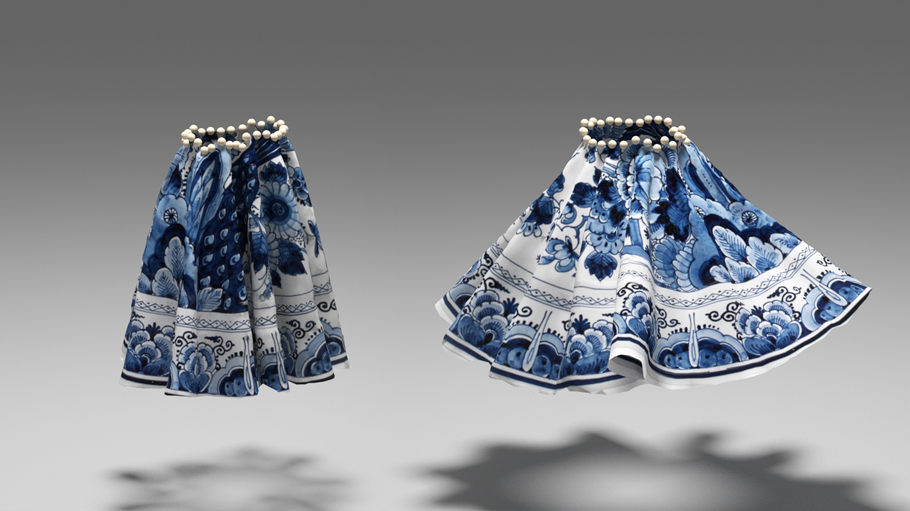

# DiffCloth
Code repository for our paper [DiffCloth: Differentiable Cloth Simulation with Dry Frictional Contact](https://people.csail.mit.edu/liyifei/publication/diffcloth-differentiable-cloth-simulator/)

To be released before SIGGRAPH 2022...

### Citation

@article{li2022diffcloth,
    author = {Li, Yifei and Du, Tao and Wu, Kui and Xu, Jie and Matusik, Wojciech},
    title = {DiffCloth: Differentiable Cloth Simulation with Dry Frictional Contact},
    year = {2022},
    publisher = {Association for Computing Machinery},
    address = {New York, NY, USA},
    issn = {0730-0301},
    url = {https://doi.org/10.1145/3527660},
    doi = {10.1145/3527660},
    abstract = {Cloth simulation has wide applications in computer animation, garment design, and robot-assisted dressing. This work presents a differentiable cloth simulator whose additional gradient information facilitates cloth-related applications. Our differentiable simulator extends a state-of-the-art cloth simulator based on Projective Dynamics (PD) and with dry frictional contact&nbsp;[Ly et&nbsp;al. 2020]},
    note = {Just Accepted},
    journal = {ACM Trans. Graph.},
    month = {mar},
    keywords = {cloth simulation, differentiable simulation, Projective Dynamics}
}
