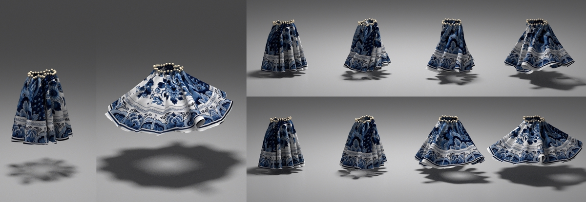

# DiffCloth
Code repository for our paper [DiffCloth: Differentiable Cloth Simulation with Dry Frictional Contact](https://people.csail.mit.edu/liyifei/publication/diffcloth-differentiable-cloth-simulator/)


[📃 Paper](https://people.csail.mit.edu/liyifei/uploads/diffcloth-highres-tog.pdf) | [🌍 Project](https://people.csail.mit.edu/liyifei/publication/diffcloth/)

### Tested Operating Systems
Ubuntu 22.04 | Mac OS 12

### 1. Download the repo:
**Make sure to use the `--recursive` option** to install the dependencies

`git clone --recursive https://github.com/omegaiota/DiffCloth.git`

### 2. Build CPP code with Cmake:
From the top directory:
```
mkdir build
cd build
cmake ..
make
```
### 3. Optimize/Visualize Section 6 Experiments:

* Run optimization:
    ```
    ./DiffCloth -demo {demooptions} -mode optimize -seed {randseed}
    ```

    where `{demooptions}` is the name of the demos from the following options and `{randseed}` is an integer for random initialization of the initial guesses
    of the tasks.

    The corresponding option for each of the experiments is:
    * 6.1 T-shirt:  `tshirt`
    * 6.1 Sphere: `sphere`
    * 6.2 Hat: `hat`
    * 6.2 Sock: `sock`
    * 6.3 Dress: `dress`

* Visualize optimization iters:
    ```
    ./DiffCloth -demo {demooptions} -mode visualize -exp {expName}
    ```

    where `{expName}` is the iteration folder for visualization. The code repo comes with an example optimization run of T-shirt in `output/tshirt-exampleopt/`, and you can visualize the first iteration with

     ```
    ./DiffCloth -demo tshirt -mode visualize -exp tshirt-exampleopt/iter0/
    ```


The progress of the optimization is saved into the `output/` directory of the root folder. Intermediate progress are visualized using the custom written OpenGL viewer.

### 4. Build Python Binding and Run Hat Controller example:
Build Python Binding:

- Install anaconda for virtual environment.
- In project root folder, run `python setup.py install` to install the python binding package. Rerun this command if you modify the CPP code.
- Create conda virtual environment: `conda env create python=3.8 --file environment.yml`, and activate it through `conda activate diffcloth`

Train/Test Hat Controller example:
- Navigate to `src/python_code`
* Test pretrained network: run `python hatController.py --eval --render --load_expname 20210809-trainedBest`
* Train network: run `python hatController.py --render`
* Resume train: run `python hatController.py --train_resume --load_expname [expName] --load_epoch [epochNum]`

Simulations are saved to the `output/` directory of the root folder.  

### Note
Feel free to contact me at liyifei@csail.mit.edu or create a Github issue if you have questions regarding setting up the repository, running examples or adding new examples. 

### Citation
Please consider citing our paper if your find our research or this codebase helpful:

    @article{Li2022diffcloth,
    author = {Li, Yifei and Du, Tao and Wu, Kui and Xu, Jie and Matusik, Wojciech},
    title = {DiffCloth: Differentiable Cloth Simulation with Dry Frictional Contact},
    year = {2022},
    issue_date = {February 2023},
    publisher = {Association for Computing Machinery},
    address = {New York, NY, USA},
    volume = {42},
    number = {1},
    issn = {0730-0301},
    url = {https://doi.org/10.1145/3527660},
    doi = {10.1145/3527660},
    abstract = {Cloth simulation has wide applications in computer animation, garment design, and robot-assisted dressing. This work presents a differentiable cloth simulator whose additional gradient information facilitates cloth-related applications. Our differentiable simulator extends a state-of-the-art cloth simulator based on Projective Dynamics (PD) and with dry frictional contact&nbsp;[Ly et&nbsp;al. 2020]. We draw inspiration from previous work&nbsp;[Du et&nbsp;al. 2021] to propose a fast and novel method for deriving gradients in PD-based cloth simulation with dry frictional contact. Furthermore, we conduct a comprehensive analysis and evaluation of the usefulness of gradients in contact-rich cloth simulation. Finally, we demonstrate the efficacy of our simulator in a number of downstream applications, including system identification, trajectory optimization for assisted dressing, closed-loop control, inverse design, and real-to-sim transfer. We observe a substantial speedup obtained from using our gradient information in solving most of these applications.},
    journal = {ACM Trans. Graph.},
    month = {oct},
    articleno = {2},
    numpages = {20},
    keywords = {differentiable simulation, cloth simulation, Projective Dynamics}
    }
